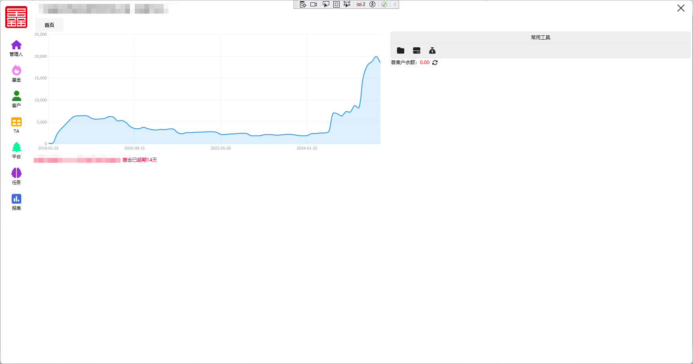
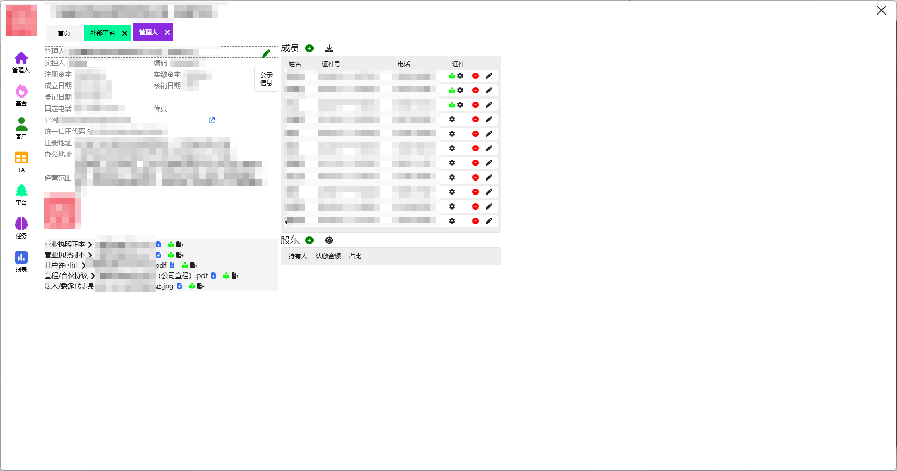
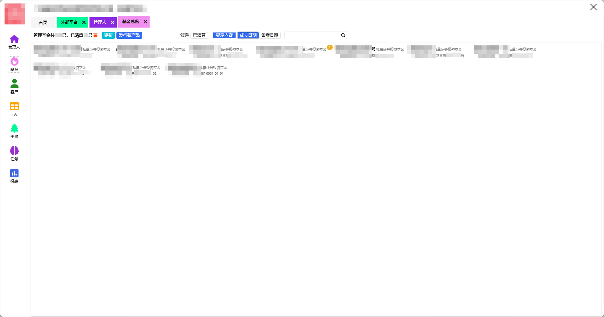
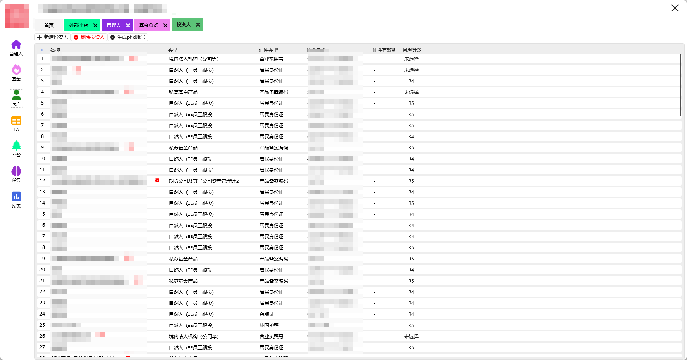
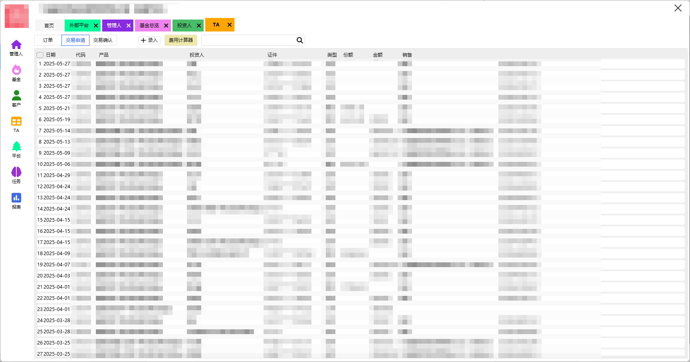
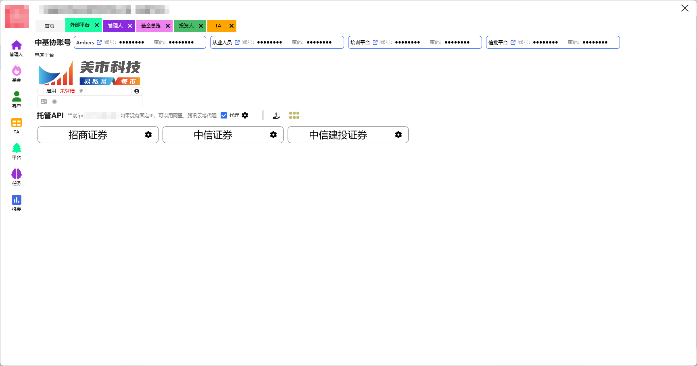
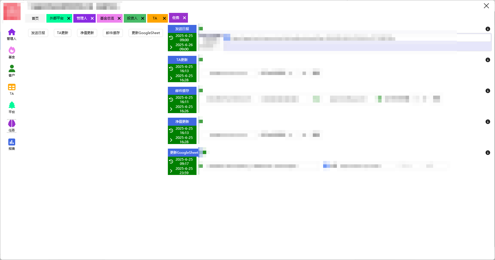
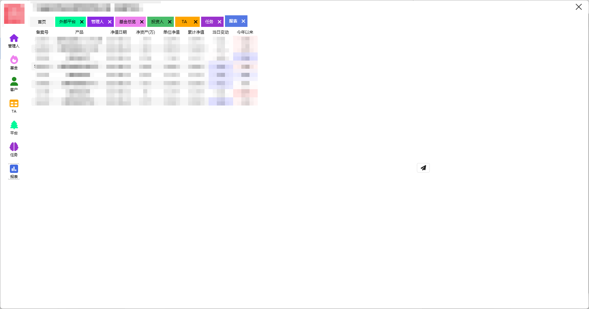

连接管理人、托管外包、基协、电子合同平台

# 首页
1. 历史规模图
2. 常用工具集
3. 各类提示信息
3. 托管提示信息

# 管理人
|      | 说明 | 状态 |
|----------|------|------|
| 管理人基本信息     | 可复制   | *已完成*   |
| 管理人证件     |    | *待完善*   |
| 成员     | 支持从协会下载数据，可设置证件，属性可复制   | *已完成*   |
| 股权结构     |     | *未完成*   |

# 基金
|      | 说明 | 状态 |
|----------|------|------|
| 列表     | 可复制   | *已完成*   |
| 从协会更新数据     |    | *已完成*   |
| 各类信息预警     | 超期、份额数据异常、净值未更新等   | *待完善*   

# 客户
|      | 说明 | 状态 |
|----------|------|------|
| 汇集投资人信息     | 可复制   | *已完成*   |
| 汇集合投资料     |    | *已完成*   |
| 从电签平台同步     | 同步资料   | *待完善*   

 

# TA

|      | 说明 | 状态 |
|----------|------|------|
| 汇集交易申请（从托管）     | 托管目前支持招商、中信、建投   | *待完善*   |
| 汇集交易确认（从托管）     |    | *待完善*   |
| 从电签平台同步     | 同步资料   | *待完善*   

# 协会、托管外包、电签平台
|      | 说明 | 状态 |
|----------|------|------|
| 同步协会数据     | 从业人员  | *待完善*   |
| 托管API对接     | 已完成 招商、中信、建投   | *待完善*   |
| 从电签平台同步     | 同步资料   | *待完善*   |

# 自动化任务
|      | 说明 | 状态 |
|----------|------|------|
| 每日发送净值报表     |     | *已完成*   |
| 从邮件中更新估值表     |     | *已完成*   |
| 从邮件中更新TA报表     | 后续将被api替代  | *已完成*   |
| 定制功能     |  可委托开发  | *已完成*   |

# 报表 
|      | 说明 | 状态 |
|----------|------|------|
| 每日净值报表     |     | *已完成*   |
| 其它各类报表     | 支持模板化导出   | *待完善*   |

